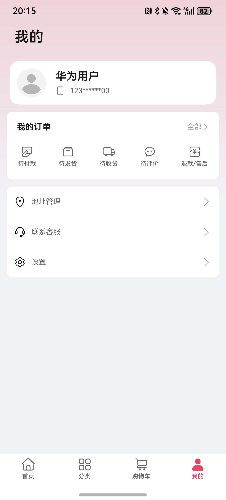

# 购物（商城）应用模板快速入门

## 目录

- [功能介绍](#功能介绍)
- [环境要求](#环境要求)
- [快速入门](#快速入门)
- [权限要求](#权限要求)
- [开源许可协议](#开源许可协议)


## 功能介绍

您可以基于此[模板](#模板)直接定制应用/元服务，也可以挑选此模板中提供的多种[组件](#组件)使用，从而降低您的开发难度，提高您的开发效率。

### 模板

本模板为综合商城应用提供了常用功能的开发样例，模板主要分首页、分类、购物车、和我的四大模块：

- 首页：主要提供商品搜索、卡片轮播、分类选择、商品浏览等功能。

- 分类：按照类别展示商品列表和购买商品。

- 购物车：展示已添加的商品，支持商品数量的修改，商品删除、结算等操作。

- 我的：展示个人信息、订单管理入口以及联系客服功能。

本模板已集成华为账号、通话、华为支付等服务，只需做少量配置和定制即可快速实现华为账号的登录、一键拨打服务电话、商品购买等功能。

| 首页                                                   | 分类                                                       | 购物车                                                   | 我的                                                        |
| ------------------------------------------------------ | ---------------------------------------------------------- | -------------------------------------------------------- | ----------------------------------------------------------- |
|  |  |  |  |

本模板主要页面及核心功能如下所示：

```ts
综合商城模板
 ├── 首页
 |    ├── 搜索建议轮播
 |    |    ├── 搜索页
 |    |    └── 搜索结果展示
 |    ├── 图片轮播
 |    ├── 分类项展示
 |    |    └── 分类浏览页
 |    └── 商品卡片瀑布流
 |         └── 商品详情页
 |              ├── 商品规格选择
 |              ├── 加入购物车
 |              └── 发起预下单
 ├── 分类
 |    ├── 商品搜索
 |    └── 商品分类浏览
 ├── 购物车
 |    ├── 购物车管理
 |    ├── 购物车结算
 |    └── 商品推荐列表
 └── 我的
      ├── 账号登录
      ├── 个人信息展示
      ├── 订单管理
      ├── 地址管理
      └── 联系客服
```

本模板工程代码结构如下所示：

```ts
├── commons
│   ├──lib_foundation/src/main/ets                // 应用基础工具包
│   │   ├── basecomponents                        // 基础组件
│   │   │   └── TitleBar.ets                      // 标题栏组件
│   │   ├── constants                             // 常量定义
│   │   ├── featurecomponents                     // 场景组件
│   │   │   ├── callbutton                        // 拨号组件
│   │   │   ├── search                            // 搜索组件
│   │   │   └── tabsswiper                        // 标题栏组件
│   │   ├── models                                // 数据模型定义
│   │   ├── types                                 // 数据接口定义
│   │   └── utils
│   │       ├── caches                            // 缓存工具
│   │       ├── idata                             // 全局数据工具
│   │       ├── resmanage                         // 资源处理工具
│   │       └── routerstack                       // 路由工具
│   │
│   └── lib_network/src/main/ets
│       ├── api
│       │   ├── CardList.ets                      // 卡片列表相关请求封装
│       │   ├── Cart.ets                          // 购物车相关请求封装
│       │   ├── Homepage.ets                      // 首页相关请求封装
│       │   ├── Order.ets                         // 订单相关请求封装
│       │   ├── Product.ets                       // 商品相关请求封装
│       │   ├── Search.ets                        // 搜索相关请求封装
│       │   └── User.ets                          // 用户相关请求封装
│       ├── mock
│       │   ├── MockDatabase.ets                  // Mock 模拟数据库
│       │   └── MockDataMgr.ets                   // Mock 数据管理类
│       ├── utils
│       │   ├── MathUtil.ets                      // 数学工具类
│       │   └── MockUtil.ets                      // Mock 工具类
│       ├── HttpClient.ets                        // Http 客户端
│       └── MockServer.ets                        // Mock 服务器
│
├── components
│   ├── module_address_manage/src/main/ets        // 地址管理组件
│   │   ├── common                                // 常量定义
│   │   ├── http                                  // 接口定义
│   │   ├── model                                 // 数据模型定义
│   │   ├── pages
│   │   │    ├── AddressEditPage.ets              // 地址编辑页
│   │   │    └── AddressManagePage.ets            // 地址管理页
│   │   └── viewmodel
│   │   │    ├── AddressMgrVM.ets                 // 地址管理viewmodel
│   │   │    └── AddressVM.ets                    // 地址类viewmodel
│   │   └── AddressManage.ets                     // 地址管理组件封装
│   │
│   ├── module_login/src/main/ets                 // 登录组件
│   │   ├── commons                               // 常量定义
│   │   ├── models                                // 数据模型定义
│   │   ├── pages
│   │   │   └── HuaweiQuickLoginPage.ets          // 华为账号一键登录页
│   │   └── utils
│   │       └── LoginUtils.ets                    // 登录工具
│   │
│   ├── module_product_detail/src/main/ets        // 商品详情组件
│   │   │── commons
│   │   │   ├── Constants.ets                     // 常量定义
│   │   │   ├── Enum.ets                          // 枚举类定义
│   │   │   ├── Models.ets                        // 数据对象类型定义
│   │   │   └── Types.ets                         // 数据接口定义
│   │   │── components
│   │   │   ├── ProductInfoCard.ets               // 商品信息卡片
│   │   │   └── ProductSwiper.ets                 // 商品轮播
│   │   │── https
│   │   │   ├── Apis.ets                          // 接口定义
│   │   │   └── MockData.ets                      // mock数据
│   │   │── viewmodels
│   │   │   └── ProductSelectorVM.ets             // 规格选择器viewmodel
│   │   └── views
│   │       ├── ProductDetail.ets                 // 商品详情
│   │       └── ProductSelector.ets               // 商品规格选择器
│   │
│   ├── module_product_waterflow/src/main/ets     // 商品瀑布流
│   │   ├── commons
│   │   │   ├── Constants.ets                     // 常量定义
│   │   │   ├── Enums.ets                         // 枚举类定义
│   │   │   └── Types.ets                         // 数据接口定义
│   │   ├── components
│   │   │   └── ProductWaterFlow.ets              // 商品瀑布流组件
│   │   ├── https
│   │   │   ├── Apis.ets                          // 接口定义
│   │   │   └── MockData.ets                      // mock数据
│   │   │
│   │   └── utils
│   │       └── LazyDataSource.ets                // 懒加载工具类
│   │
│   └── module_shopping_cart/src/main/ets         // 购物车组件
│       ├── commons                               // 常量定义
│       ├── components
│       │   ├── basic                             // 基础组件
│       │   ├── CartCard.ets                      // 购物车商品卡片
│       │   ├── CartControlPanel.ets              // 购物车管理面板
│       │   ├── CartListView.ets                  // 购物车商品列表
│       │   ├── CartPageHeader.ets                // 购物车页面标题
│       │   └── PopupSheet.ets                    // 弹出框
│       ├── http                                  // 接口定义
│       ├──viewmodel
│       │   └── CartPageVM.ets                    // 购物车页面viewmodel
│       └── views
│           └── ShoppingCart.ets                  // 购物车组件
│
├── scenes                                        // 场景化模块
│    ├── order/src/main/ets                       // 订单
│    │  └── pages
│    │      ├── OrderInfoPage.ets                 // 订单详情页
│    │      ├── OrderListPage.ets                 // 订单列表页
│    │      └── OrderSearchPage.ets               // 订单搜索页
│    └──shopping/src/main/ets
│       └── pages
│           ├── CartPage.ets                      // 购物车页面
│           ├── OrderSubmitPage.ets               // 订单提交页面
│           ├── ProductInfoPage.ets               // 商品详情页面
│           ├── ProductSearchPage.ets             // 商品搜索页面
│           └── ProductSearchResultsPage.ets      // 商品搜索结果页面
│
└── products
    └── entry/src/main/ets
       ├── components
       │   ├──CategoryPageContent.ets             // 分类页详情
       │   ├──HomePageContent.ets                 // 首页详情
       │   └──IconTextTab.ets                     
       ├── pages
       │   ├── AgreementPage.ets                  // 隐私政策&用户协议页
       │   ├── CategoryPage.ets                   // 分类页
       │   ├── EditProfilePage.ets                // 用户信息编辑
       │   ├── HomePage.ets                       // 首页
       │   ├── Index.ets                          // 入口页
       │   ├── ProfilePage.ets                    // 我的页
       │   ├── SettingPage.ets                    // 设置页
       │   └── SubCategoryPage.ets                // 分类子页
       └── widget                                 // 服务卡片

```

### 组件

本模板中提供了多种组件，您可以按需选择合适的组件进行使用，所有组件存放在工程根目录的components下。

| 组件                                  | 描述                                                         | 使用指导                                                 |
| ------------------------------------- | ------------------------------------------------------------ | -------------------------------------------------------- |
| 地址管理组件（module_address_manage） | 提供新增/编辑/删除地址相关的场景化组件                       | [使用指导](./components/module_address_manage/README.md) |
| 商品详情组件（module_product_detail） | 提供商品详情组件，支持详情展示和规格选择                     | [使用指导](./components/module_product_detail/README.md) |
| 购物车组件（module_shopping_cart）    | 提供了购物车商品列表展示，商品选择、删除、增减商品数量、查看明细、结算等相关功能的场景化组件 | [使用指导](./components/module_shopping_cart/README.md)  |


## 环境要求

### 软件

- DevEco Studio版本：DevEco Studio 5.0.1 Release及以上
- HarmonyOS SDK版本：HarmonyOS 5.0.1 Release SDK及以上

### 硬件

- 设备类型：华为手机（直板机）
- HarmonyOS版本：HarmonyOS 5.0.1 Release及以上

## 快速入门

### 配置工程

在运行此模板前，需要完成以下配置：

1. 在AppGallery Connect创建应用，将包名配置到模板中。

   a. 参考[创建HarmonyOS应用](https://developer.huawei.com/consumer/cn/doc/app/agc-help-createharmonyapp-0000001945392297)为应用创建APP ID，并将APP ID与应用进行关联。

   b. 返回应用列表页面，查看应用的包名。

   c. 将AppScope/app.json5文件中的bundleName替换为创建应用的包名。

2. 配置华为账号服务。

   a. 将应用的client ID配置到products/entry/src/main路径下的module.json5文件中，详细参考：[配置Client ID](https://developer.huawei.com/consumer/cn/doc/harmonyos-guides/account-client-id)。

   b. 添加公钥指纹，详细参考：[配置应用证书指纹](https://developer.huawei.com/consumer/cn/doc/app/agc-help-signature-info-0000001628566748#section5181019153511)。

   c. 申请华为账号一键登录所需的quickLoginMobilePhone权限，详细参考：[配置scope权限](https://developer.huawei.com/consumer/cn/doc/harmonyos-guides/account-config-permissions)。

3. 配置支付服务。

   华为支付当前仅支持商户接入，在使用服务前，需要完成商户入网、开发服务等相关配置，本模板仅提供了端侧集成的示例。详细参考：[支付服务接入准备](https://developer.huawei.com/consumer/cn/doc/harmonyos-guides/payment-preparations)。

### 运行调试工程

1. 连接调试手机和PC。

2. 对应用[手工签名](https://developer.huawei.com/consumer/cn/doc/harmonyos-guides/ide-signing)。

3. 菜单选择“Run > Run 'entry' ”或者“Run > Debug 'entry' ”，运行或调试模板工程。


## 权限要求

- 网络权限：ohos.permission.INTERNET

## 开源许可协议

该代码经过[Apache 2.0 授权许可](http://www.apache.org/licenses/LICENSE-2.0)。
