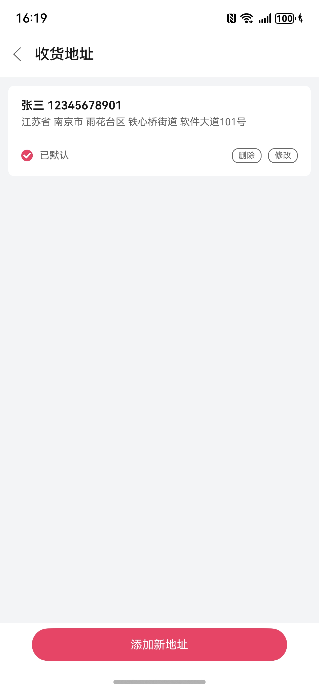

# 地址管理组件快速入门

## 目录

- [简介](#简介)
- [使用](#使用)
- [API参考](#API参考)
- [示例代码](#示例代码)

## 简介

本组件提供地址管理场景组件。

| 地址列表                                         | 地址编辑                                         |
|----------------------------------------------|----------------------------------------------|
|  |  |

## 使用

1. 安装组件。

   将模板工程根目录的components下[module_address_manage](../module_address_manage)目录拷贝至您工程根目录的components/，并添加依赖和module声明。

```
// entry/oh-package.json5
"dependencies": {
  "module_address_manage": "file:../components/module_address_manage"
}

// build-profile.json5
"modules": [
  {
    "name": "module_address_manage",
    "srcPath": "./components/module_address_manage"
  }
]
```

2. 引入组件。

```
import { AddressManage, AddressDTO } from 'module_address_manage';
```

## API参考

### getDefaultAddress(Promise<[AddressDTO](#AddressDTO) | undefined>)

**获取默认地址**

### AddressManage(option: AddressManageOptions)

**AddressManageOptions对象说明**

| 参数名               | 类型                                                     | 必填            | 说明                    |
|:------------------|:-------------------------------------------------------|:--------------|:----------------------|
| navPathStack      | NavPathStack                                           | 是             | Navigation路由栈实例       |
| isSelectMode      | boolean                                                | 否             | 是否开启地址选择模式            |
| onSelect          | (address: [AddressDTO](#AddressDTO)) => void           | 否             | 选择地址后的回调              |
| onBeforeNavigate  | () => boolean                                          | 否             | 页面跳转前的回调，返回false将取消跳转 |

### AddressDTO

表示地址数据的结构体，用于页面组件传入、组件内部管理，或作为网络接口的请求/响应格式。

| 字段名              | 类型          | 必填  | 说明                  |
|------------------|-------------|-----|---------------------|
| `id`             | `string`    | 是   | 地址唯一标识符             |
| `name`           | `string`    | 是   | 姓名                  |
| `phone`          | `string`    | 是   | 手机号                 |
| `countryCode`    | `string`    | 是   | 国家代码（如 `"CN"` 表示中国） |
| `country`        | `string`    | 是   | 国家名称（如 `"中国"`）      |
| `province`       | `string`    | 是   | 所在省份                |
| `city`           | `string`    | 是   | 所在城市                |
| `district`       | `string`    | 是   | 所在区/县               |
| `street`         | `string`    | 是   | 街道名称（如乡镇、街道）        |
| `detail`         | `string`    | 是   | 详细地址（如门牌号、楼栋房间号）    |
| `isDefault`      | `boolean`   | 是   | 是否为默认地址             |
| `createdAt`      | `number`    | 是   | 创建时间戳（毫秒）           |
| `updatedAt`      | `number`    | 是   | 更新时间戳（毫秒）           |

## 示例代码

```
import { AddressManage, AddressDTO } from 'module_address_manage';

@Entry
@ComponentV2
struct Index {
  private readonly TAG: string = 'AddressManageDemo';

  private navPathStack: NavPathStack = new NavPathStack()

  public build(): void {
    Navigation(this.navPathStack) {
      Column() {
        AddressManage({
          navPathStack: this.navPathStack,
          isSelectMode: true,
          onSelect: (address: AddressDTO) => {
            console.info(this.TAG, '当前所选地址：' + JSON.stringify(address));
          },
          onBeforeNavigate: () => {
            console.info(this.TAG, '页面跳转');
            return true;
          }
        }) {
          Button('地址管理')
        }
      }
      .width('100%')
      .height('100%')
      .justifyContent(FlexAlign.Center)
    }
    .hideTitleBar(true)
  }
}
```
