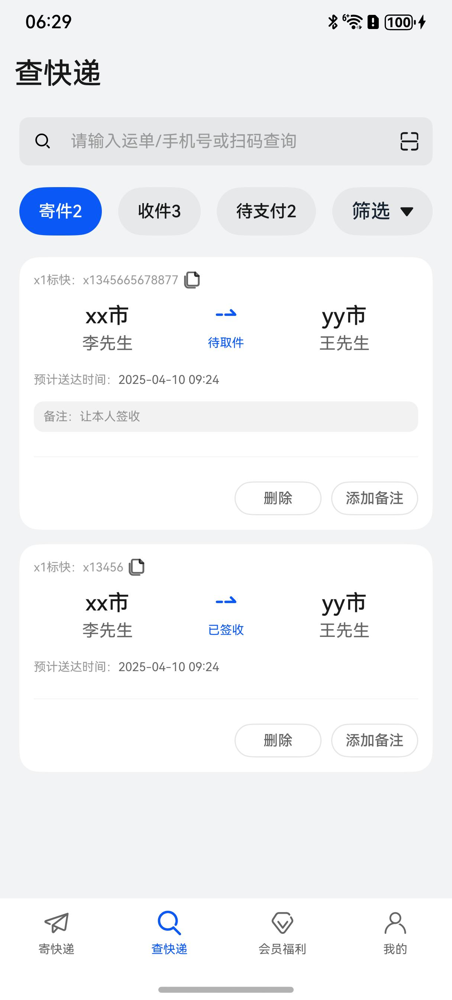
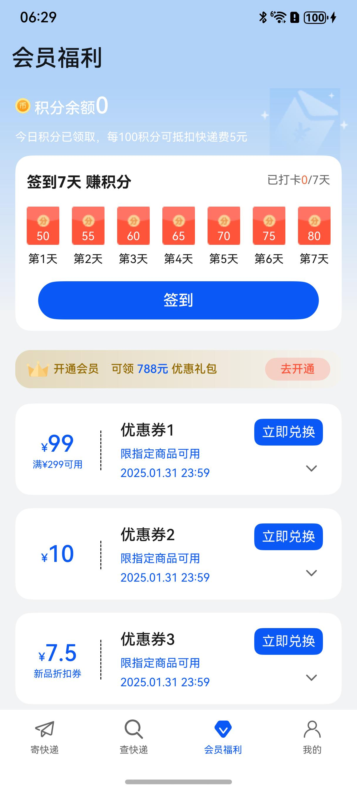
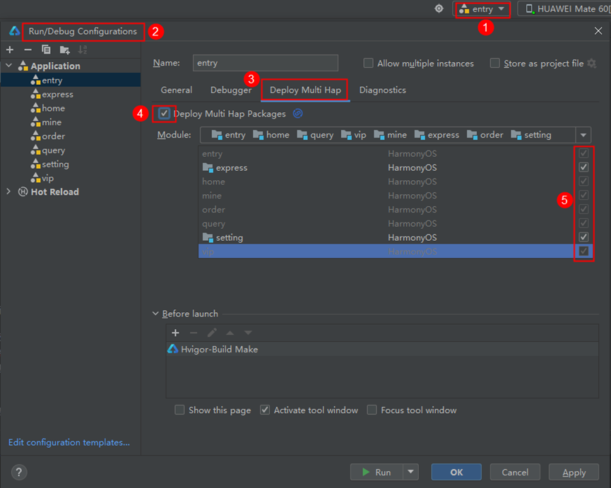

# 购物（快递）应用模板快速入门

## 目录

- [功能介绍](#功能介绍)
- [环境要求](#环境要求)
- [快速入门](#快速入门)
- [示例效果](#示例效果)
- [权限要求](#权限要求)
- [开源许可协议](#开源许可协议)

## 功能介绍

您可以基于此[模板](#模板)直接定制应用/元服务，也可以挑选此模板中提供的多种[组件](#组件)使用，从而降低您的开发难度，提高您的开发效率。

### 模板
本模板为快递物流类应用提供了常用功能的开发样例，模板主要分寄快递、查快递、会员福利和我的四大模块：

* 寄快递：提供寄快递、模板、物品等。

* 查快递：展示快递信息，筛选搜索快递等。

* 会员福利：展示签到、优惠券等。

* 我的：展示登录、地址簿、实名认证等。

本模板已集成华为账号、支付等服务，只需做少量配置和定制即可快速实现华为账号的登录和寄快递等功能。

| 寄快递                          | 查快递                          | 会员福利                           | 我的                         |
|------------------------------|------------------------------|--------------------------------|----------------------------|
|  |  |  |  |

本模板主要页面及核心功能如下所示：

```ts
快递物流模板
 |-- 寄快递
 |    └-- 顶部寄件详情
 |    └-- 用户服务
 |    |    └-- 开通会员
 |    |    └-- 实名认证
 |    └-- 基础服务
 |    |    └-- 寄快递
 |    |    |    |-- 添加模板
 |    |    |    |-- 模板列表
 |    |    |    |-- 地址列表
 |    |    |    └-- 物品列表
 |    |    |    └-- 寄快递
 |    |    └-- 发物流
 |    |    |    |-- 添加模板
 |    |    |    |-- 模板列表
 |    |    |    |-- 地址列表
 |    |    |    └-- 物品列表
 |    |    |    └-- 寄快递
 |    └-- 咨询客服
 |    └-- 充值会员
 |-- 查快递
 |    └-- 顶部搜索
 |    └-- 快递列表
 |    |    └-- 快递详情
 |    |    |    |-- 地图
 |    |    |    |-- 支付
 |    |    |    |-- 客服
 |    |    |    └-- 修改信息
 |-- 会员福利
 |    └-- 签到详情
 |    └-- 开通会员
 |         └-- 会员支付
 |    └-- 优惠券列表
 └-- 我的
      └-- 账号
      |    |-- 账号登录
 |    |    |-- 账号详情
 |    |    └-- 账号信息修改
 |    └-- 我的快递
 |    └-- 地址簿
 |    |    └-- 地址列表
 |    └-- 实名认证
 |    └-- 联系客服
 |    └-- 滚动公告
 |    └-- 设置
           └-- 推送通知
           └-- 清楚缓存
```

本模板工程代码结构如下所示：

```ts
ExpressTemplate
  |- commons                                       // 公共层
  |   |- lib_foundation/src/main/ets               // 公共工具模块(har)
  |   |    |- common 
  |   |    |     Contant.ets                       // 公共常量
  |   |    |- http 
  |   |    |     ApiManage.ets                     // API管理
  |   |    |     AxiosBase.ets                     // 网络请求基类
  |   |    |     HttpMockMap.ets                   // 接口映射
  |   |    |     MockApi.ets                       // Mock的API
  |   |    |     MockData.ets                      // MOCK数据
  |   |    |- model 
  |   |    |     IRequest.ets                      // 请求类型
  |   |    |     IResponse.ets                     // 响应数据类型
  |   |    |     ObserveModel.ets                  // 响应式数据结构
  |   |    |- router 
  |   |    |     RouterModule.ets                  // 路由
  |   |    └- uicomponent 
  |   |          CommonAddress.ets                  // 地址簿组件
  |   |          CommonCounter.ets                  // 计数器组件
  |   |          CommonDivider.ets                  // 分割线组件
  |   |          CommonSaveButton.ets               // 按钮组件
  |   |  
  |   |- components                                 // 公共组件模块(har)
  |   |     └- module_address/src/main/ets          // 地址 
  |   |     |    |- common                          // 常量、工具函数            
  |   |     |    |- http                            // 网络请求数据         
  |   |     |    |- pages                           
  |   |     |    |    AddressPage.est               // 地址列表页
  |   |     |    |    EditAddressPage.est           // 地址编辑页
  |   |     |    └- viewmodel                       // 与页面一一对应的vm层 
  |   |     └- module_auth/src/main/ets             // 实名认证                      
  |   |     |    |- pages                           
  |   |     |    |    RealNameAuthPage.est          // 实名认证页
  |   |     |    |- types                           // 类型
  |   |     |    └- viewmodel                       // 与页面一一对应的vm层 
  |   |     └- module_base/src/main/ets             // 基础 
  |   |     |    |- common                          // 常量、工具函数     
  |   |     |    |- component                       // 基础组件
  |   |     |    └- types                           // 数据类型                
  |   |     └- module_city/src/main/ets             // 城市选择组件 
  |   |     |    |- components                      
  |   |     |    |    CommonCascade.est             // 组件页面            
  |   |     |    |- types                           // 类型         
  |   |     |    └- Utils                           // 工具类
  |   |     └- module_template/src/main/ets         // 模板 
  |   |     |    |- common                          // 常量、工具函数            
  |   |     |    |- http                            // 网络请求数据         
  |   |     |    |- pages                           
  |   |     |    |    TemplateListPage.est          // 模板列表页
  |   |     |    |    TemplatePage.est              // 模板编辑页
  |   |     |    └- viewmodel                       // 与页面一一对应的vm层    
  |- products/entry                                 // 应用层主包(hap)  
  |   └-  src/main/ets                                               
  |        |- entryability                                                               
  |        |- entryformability                                                        
  |        |- pages                              
  |        |    MainEntry.ets                       // 主页面
  |        |- types                                 // interface接口定义
  |        |- viewmodels                            // 与页面一一对应的vm层          
  |        └- widget                                // 卡片页面 
  |                                            
  |- features                                         
     |- business_home/src/main/ets                  // 快递tab页功能组合(har)
     |   |- components                              // 抽离组件 
     |   |- constants                               // 常量
     |   |- pages                               
     |   |   ExpressPage.ets                        // 快递首页
     |   |   GoodsPage.ets                          // 物品页
     |   |   HomePage.ets                           // 首页
     |   |   ServicePointPage.ets                   // 服务点页
     |   |- types                                   // interface类型定义
     |   └- viewModels                              // 与页面一一对应的vm层 
     | 
     └- business_mine/src/main/ets                  // 我的tab页功能组合(har)
     |   |- components                              // 抽离组件 
     |   |- constants                               // 常量
     |   |- pages                               
     |   |   EditNamePage.ets                       // 姓名编辑页
     |   |   EditPhonePage.ets                      // 手机号编辑页
     |   |   MinePage.ets                           // 我的页
     |   |   PersonalInformationPage.ets            // 个人信息页
     |   |   PrivacyPage.ets                        // 隐私页
     |   |   QuickLoginPage.ets                     // 登录页
     |   |   SettingPage.ets                        // 设置页
     |   |- types                                   // interface类型定义
     |   └- viewModels                              // 与页面一一对应的vm层 
     └- business_order/src/main/ets                 // 订单tab页功能组合(har)
     |   |- components                              // 抽离组件 
     |   |- constants                               // 常量
     |   |- pages                               
     |   |   EditOrderPage.ets                      // 订单编辑页
     |   |   OrderInfoPage.ets                      // 订单详情页
     |   |   OrderPage.ets                          // 订单列表页
     |   |- types                                   // interface类型定义
     |   └- viewModels                              // 与页面一一对应的vm层 
     └- business_vip/src/main/ets                   // 会员tab页功能组合(har)
     |   |- components                              // 抽离组件 
     |   |- constants                               // 常量
     |   |- pages                               
     |   |   PurchasePage.ets                       // 购买页
     |   |   VipPage.ets                            // VIP页
     |   |- types                                   // interface类型定义
     |   └- viewModels                              // 与页面一一对应的vm层  

```

### 组件

本模板中提供了多种组件，您可以按需选择合适的组件进行使用，所有组件存放在工程根目录的components下。

| 组件                            | 描述                             | 使用指导                                         |
| :------------------------------ | :------------------------------- | :----------------------------------------------- |
| 组件基础能力（module_base）     | 提供组件最小公共能力集           | [使用指导](components/module_base/README.md)     |
| 地址管理组件（module_address）  | 提供新增、编辑、删除地址相关功能 | [使用指导](components/module_address/README.md)  |
| 实名认证组件（module_auth）     | 提供实名认证的功能               | [使用指导](components/module_auth/README.md)     |
| 城市选择组件（module_city）     | 提供按省、市、区选择城市的功能   | [使用指导](components/module_city/README.md)     |
| 模板管理组件（module_template） | 提供新增、编辑、删除模板相关功能 | [使用指导](components/module_template/README.md) |

## 环境要求

### 软件

* DevEco Studio版本：DevEco Studio 5.0.2 Release及以上
* HarmonyOS SDK版本：HarmonyOS 5.0.1(13) Release SDK及以上

### 硬件

* 设备类型：华为手机（直板机）
* HarmonyOS版本：HarmonyOS 5.0.2 Release及以上

## 快速入门

### 配置工程

在运行此模板前，需要完成以下配置：

1. 在DevEco Studio中打开此模板。

2. 在AppGallery Connect创建应用，将包名配置到模板中。

   a. 参考[创建应用](https://developer.huawei.com/consumer/cn/doc/app/agc-help-createharmonyapp-0000001945392297)为应用创建APPID，并进行关联。

   b. 返回应用列表页面，查看应用的包名。

   c. 将模板工程根目录下AppScope/app.json5文件中的bundleName替换为创建应用的包名。

3. 配置华为账号服务。

   a. 将应用的client ID配置到entry模块的module.json5文件，详细参考：[配置Client ID](https://developer.huawei.com/consumer/cn/doc/harmonyos-guides/account-client-id)。

   b. 添加公钥指纹，详细参考：[配置应用证书指纹](https://developer.huawei.com/consumer/cn/doc/app/agc-help-signature-info-0000001628566748#section5181019153511)。

   c. 如需获取用户真实手机号，需要申请phone权限和quickLoginMobilePhone权限，详细参考：[配置scope权限](https://developer.huawei.com/consumer/cn/doc/harmonyos-guides/account-config-permissions)。

4. 配置支付服务。

   华为支付当前仅支持商户接入，在使用服务前，需要完成商户入网、开发服务等相关配置，本模板仅提供了端侧集成的示例。详细参考：[支付服务接入准备](https://developer.huawei.com/consumer/cn/doc/harmonyos-guides/payment-preparations)。

### 运行调试工程

1. 连接调试手机和PC。

2. 对应用签名：由于模板中集成了华为账号等服务，所以需要采用[手工签名](https://developer.huawei.com/consumer/cn/doc/harmonyos-guides/ide-signing)。

3. 配置多模块调试：由于本模板存在多个模块，运行时需确保所有模块安装至调试设备。

   a. 运行模块选择“entry”。

   b. 下拉框选择“Edit Configurations”，在“Run/Debug Configurations”界面，选择“Deploy Multi Hap”页签，勾选上模板中所有模块。

   

   c. 点击"Run"，运行模板工程。

## 示例效果

[功能展示录屏](./screenshots/功能展示录屏.mp4)

## 权限要求

* 网络权限：ohos.permission.INTERNET
* 相机权限：ohos.permission.CAMERA

## 开源许可协议

该代码经过[Apache 2.0 授权许可](http://www.apache.org/licenses/LICENSE-2.0)。
