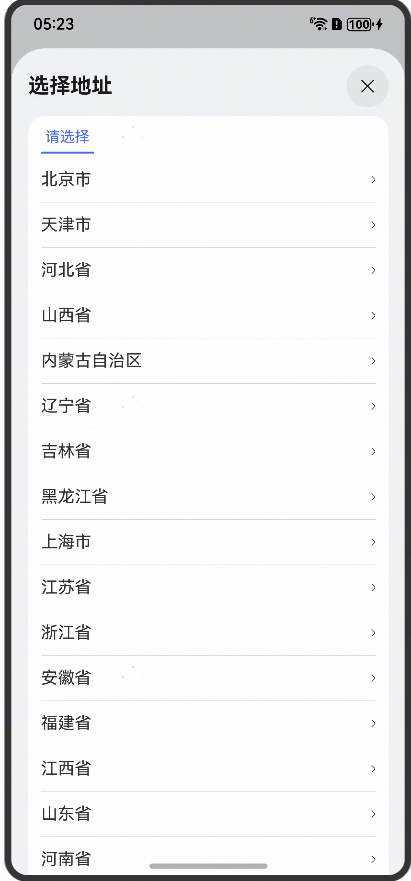

# 城市选择组件快速入门

## 目录

- [简介](#简介)
- [前提](#前提)
- [使用](#使用)
- [API参考](#API参考)
- [示例代码](#示例代码)

## 简介

本组件提供按省、市、区选择城市相关功能。



## 前提

## 使用

1. 安装组件。

   由于城市选择组件依赖module_city组件，所以需要将模板根目录的components下
   [module_city](../module_city)目录拷贝至您的工程相应目录，并添加依赖。

```
"dependencies": {
  "module_city": "file:../module_city"
}
```

## API参考

| <div style="width:200px" align="left">参数</div> | <div style="width:200px" align="left">类型</div> | <div style="width:80px" align="left">必填</div> | <div style="width:200px" align="left">说明</div> |
|:-----------------------------------------------|:-----------------------------------------------|:----------------------------------------------|:-----------------------------------------------|
| province                                       | string                                         | 否                                             | 省                                              |
| city                                           | string                                         | 否                                             | 市                                              |
| area                                           | string                                         | 否                                             | 区                                              |

| <div style="width:200px" align="left">事件</div> | <div style="width:200px" align="left">类型</div> | <div style="width:200px" align="left">说明</div> |
|:-----------------------------------------------|:-----------------------------------------------|:-----------------------------------------------|
| onChange                                       | (data: string[]) => void                       | 获取更改后的数据                                       |

## 示例代码

```
@Entry
@ComponentV2
struct Sample {
  build() {
    Navigation(this.stack) {
      CommonCascade({
        province: '江苏',
        city: '南京',
        area: '雨花台区',
      })
    }
    .hideTitleBar(true)
  }
}
```
