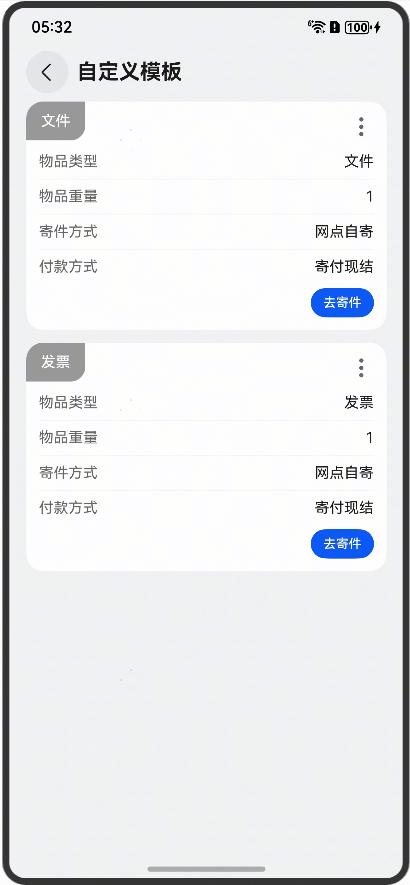
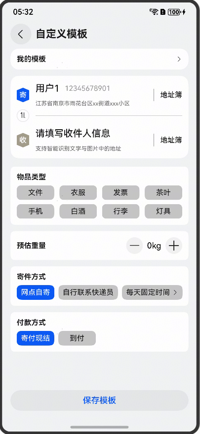

# 模板管理场景组件快速入门

## 目录

- [简介](#简介)
- [前提](#前提)
- [使用](#使用)
- [API参考](#API参考)
- [示例代码](#示例代码)

## 简介

本组件提供模板管理场景组件，寄件模板业务组件可以生成一个固定物品信息的寄件模板，方便用户多次寄送同一类快递。

| 模板列表                                         | 模板编辑                                         |
|----------------------------------------------|----------------------------------------------|
|  |  |

## 使用

1. 安装组件。

   由于模板管理场景组件依赖module_base、module_address组件，所以需要将模板根目录的components下
   [module_base](../module_base)、[module_template](../module_template)、[module_address](../module_address)
   目录拷贝至您的工程相应目录，并添加依赖。

```
"dependencies": {
  "module_template": "file:../module_template"
}
```

## API参考

不涉及。

## 示例代码

```
@Entry
@ComponentV2
struct TemplateSample1 {
  stack: NavPathStack = new NavPathStack()

  build() {
    Navigation(this.stack) {
      Column({ space: 10 }) {
        Text('模板管理').fontSize(20).fontWeight(FontWeight.Bold)
        Button('go').width('100%').onClick(() => {
          this.stack.pushPath({
            name: 'TemplatePage',
          })
        })
      }
      .padding(10)
    }
    .hideTitleBar(true)
  }
}
```

```
@Entry
@ComponentV2
struct TemplateSample {
  stack: NavPathStack = new NavPathStack()

  build() {
    Navigation(this.stack) {
      Column({ space: 10 }) {
        Text('模板列表管理').fontSize(20).fontWeight(FontWeight.Bold)
        Button('go').width('100%').onClick(() => {
          this.stack.pushPath({
            name: 'TemplateListPage',
          })
        })
      }
      .padding(10)
    }
    .hideTitleBar(true)
  }
}
```